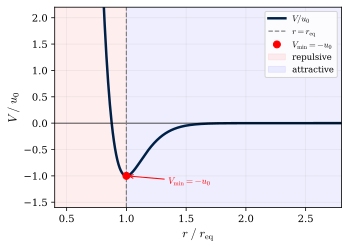

---
layout: section
---

<div class="text-center">
  <div class="text-8xl font-bold" style="color:#002147">Part 1</div>
  <div class="text-3xl mt-6 opacity-70">SEM Theory</div>
</div>

---
class: spread
---

# Motivation: Modelling Cell Rheology

- Simple cell models treat a cell as a single point or sphere
  - The only thing that can move is its centre
  - They can't show a cell changing shape, flowing, or stretching
- Real cells are squishy: they deform, flow, and have a stiffer outer "cortex"
- Key question: can simple, local rules between many small parts produce this realistic,
  whole-cell behaviour?
- Solution (Sandersius &amp; Newman, 2008): represent each cell as **$N$ interacting subcellular
  elements**

---
class: spread
---

# SEM: One Cell = A Cloud of Subcellular Elements

- Each biological cell is represented by a **SemElement**: a cloud of $N$ **subcellular
  elements** (nodes)
- Two kinds of interaction between nodes:
  - **Intra-cellular**: nodes in the *same* cell &mdash; hold the cell together, resist overlap
  - **Inter-cellular**: nodes in *different* cells &mdash; adhesion, resist overlap
- Node positions evolve under a simple, noisy equation of motion (next slide)
- Cell shape, stiffness and deformability all **emerge** from how the nodes are arranged
- Some nodes are labelled **interior** (bulk) and others **boundary/cortex** (surface), so the
  two regions can behave differently

---

# Equation of Motion

Each node's motion is governed by a simple balance of forces &mdash; a **Langevin equation**:

$$
\eta\,\dot{\mathbf{y}}_\alpha \;=\; \boldsymbol{\xi}_\alpha
  \;-\; \nabla_{\!\alpha}\!\sum_{\beta \ne \alpha} V(|\,\mathbf{y}_\alpha - \mathbf{y}_\beta|)
$$

<div class="grid grid-cols-2 gap-4 mt-4 text-sm">
<div>

- $\eta$: viscous drag from the cytoplasm (cells are heavily damped, so inertia is negligible)
- $\boldsymbol{\xi}_\alpha$: random thermal jiggling

</div>
<div>

- The sum: a spring-like pull towards every neighbouring node $\beta$, via a pairwise
  potential $V$

</div>
</div>

In words: **each node feels drag, a pull from its neighbours, and random noise.**

Forward-Euler integration: $\Delta y = (F/\eta)\,\Delta t$

<div class="absolute bottom-4 right-6 text-xs opacity-50 italic">
Sandersius &amp; Newman, Phys. Biol. <b>5</b>, 015002 (2008)
</div>

---

# How Elements Interact: Pairwise Potential

Two nodes interact via a potential $V(r)$ that depends only on their separation $r$:

$$
V(r) = u_0\,e^{2\rho(1-r^2/r_\text{eq}^2)}
      - 2u_0\,e^{\rho(1-r^2/r_\text{eq}^2)}
$$

<div class="grid grid-cols-2 gap-4 mt-2">
<div>

- $r_\text{eq}$: equilibrium separation &mdash; nodes settle here, neither pushed nor pulled
- Closer than $r_\text{eq}$: **repulsive** (so cells don't collapse)
- Further than $r_\text{eq}$, up to a cut-off: **attractive** (holds nodes together)
- Separate $(u_0,\rho,r_\text{eq})$ for intra- vs inter-cellular pairs

</div>
<div>



</div>
</div>

---

# How Elements Interact: Pairwise Potential

For small stretches near $r_\text{eq}$, this behaves just like a simple spring (Hooke's law):

$$
V_\text{lin}(r) \approx \tfrac{1}{2}\kappa(r-r_\text{eq})^2,
\qquad \kappa = \frac{8\rho^2 u_0}{r_\text{eq}^2}
$$

<div class="grid grid-cols-2 gap-4 mt-2">
<div>

`SemLinearForce` uses this cheaper spring approximation directly.

</div>
<div>


</div>
</div>

---

# Springy and Viscous: Kelvin-Voigt Behaviour

Take two connected elements: a spring, damped by the cytoplasm:

$$
\eta\,\dot{\mathbf{y}}_1 = \boldsymbol{\xi}_1 - \kappa(\mathbf{y}_1 - \mathbf{y}_2)
$$

This is a **Kelvin-Voigt** body: a spring and a damper (dashpot) acting together.

- Solid-like (springy) at short times; fluid-like (flowing) at long times
- $\eta/\kappa$ sets how long that crossover takes: about 1 s for a living cell
- A whole cell has *many* connected elements, each with a slightly different crossover time.
  Together they reproduce the smooth, gradual "creep" seen in real cells, rather than a single
  sharp spring-like snap.

---

# Thermal Noise

A random force is added independently to each node at every time step, representing
molecular-scale thermal jiggling of the cytoplasm:

$$
\mathbf{F}_\text{noise} = \eta\sqrt{\frac{2D}{\Delta t}}\,\mathbf{z},
\qquad \mathbf{z} \sim \mathcal{N}(\mathbf{0},\,\mathbf{I})
$$

- $D$: diffusion constant, controls how strong the jiggling is; $\Delta t$: time step
- Chaste offers two flavours:
  - **`SemGaussianRandomForce`**: each node jiggles independently
  - **`SemSpatiallyCorrelatedRandomForce`**: nearby nodes jiggle together, like a shared local
    current

---

# Keeping Behaviour Consistent as Resolution Changes

Problem: using more nodes $N$ per cell shrinks the spacing between them.
Solution: rescale $r_\text{eq}$ and $\kappa$ so the cell's overall stiffness stays the same:

$$
r_\text{eq}(N) = 2R\!\left(\frac{p}{N}\right)^{\!1/d},
\qquad
\kappa(N) = \kappa_0\,N^{-1/d}
$$

- $R$: cell radius; $p$: packing density; $d$: dimension (2D or 3D)
- This means you can add more elements for finer detail, without changing how stiff or squishy
  the whole cell appears
- Damping is rescaled too (Sandersius &amp; Newman, 2008, Section 2), so whole-cell dynamics
  look the same regardless of how finely the cell is resolved

---
class: spread
---

# Interior vs. Cortex: Regional Structure

Nodes can be labelled **interior** (bulk of the cell) or **boundary/cortex** (the outer
surface), and the interaction strength can differ between them:

- Higher stiffness on the cortex mimics a real cell's stiffer outer skin (surface tension)
- Shorter rest length on the cortex models a thinner membrane layer


**How well does this simple model do?** Tested against real single-cell rheology experiments
(Sandersius &amp; Newman, 2008):
- Realistic stiffness, and creep/recovery under small stretches &#10003;
- Yields and breaks under large stretches, like a real cell &#10003;
- Doesn't capture long-time active flow (no cytoskeletal remodelling) &mdash; needs extensions &#10007;


---
layout: section
---

<div class="text-center">
  <div class="text-8xl font-bold" style="color:#002147">Part 2</div>
  <div class="text-3xl mt-6 opacity-70">Chaste Implementation</div>
</div>

---

# Where SEM Sits: A Spectrum of Cell Models

Models vary in how much sub-cellular detail they resolve:

<div class="flex gap-1 mt-5 text-center">
  <div class="flex-1 rounded-lg py-3 px-1 text-xs font-bold leading-tight" style="background:#c5d5e8;color:#002147;border:1px solid #8bacc8">Cellular<br>Automaton</div>
  <div class="flex-1 rounded-lg py-3 px-1 text-xs font-bold leading-tight" style="background:#a4bcda;color:#002147;border:1px solid #6e9abd">Cellular<br>Potts</div>
  <div class="flex-1 rounded-lg py-3 px-1 text-xs font-bold leading-tight" style="background:#7e9ecb;color:#002147;border:1px solid #5280b0">Centre-<br>based</div>
  <div class="flex-1 rounded-lg py-3 px-1 text-xs font-bold leading-tight" style="background:#5b81bb;color:white;border:1px solid #3a63a9">Node-<br>based</div>
  <div class="flex-1 rounded-lg py-3 px-1 text-xs font-bold leading-tight" style="background:#3a63a9;color:white;border:1px solid #1c4089">Vertex</div>
  <div class="flex-1 rounded-lg py-3 px-1 text-xs font-bold leading-tight" style="background:#1c4089;color:white;border:1px solid #002147">Immersed<br>Boundary</div>
  <div class="flex-1 rounded-lg py-3 px-1 text-xs font-bold leading-tight" style="background:#002147;color:white;border:2px solid #e53e3e">SEM<br><span style="color:#fc8181;font-size:0.65rem">&#9733; this work</span></div>
</div>
<div class="mt-2 text-center text-sm italic opacity-60">
  Increasing biophysical detail&ensp;&rarr;
</div>

<div class="mt-4 grid grid-cols-3 gap-2 text-sm">
<div>

- Each step gains mechanical fidelity at increased computational cost

</div>
<div>

- SEM uniquely captures: cell deformation, cortex/interior distinction, rheology

</div>
<div>

- All of the above are implemented in Chaste

</div>
</div>

---

# Key Classes at a Glance

| Concept | Chaste class | What it does |
|---|---|---|
| All the nodes, for every cell | `SemMesh` | Stores nodes, finds nearby pairs efficiently |
| One "cell" | `SemElement` | Holds the set of nodes belonging to that cell |
| Cells + mesh + bookkeeping | `SemBasedCellPopulation` | Ties everything together for a simulation |
| The physics | `SemForce` family | Computes the pairwise forces each time step |

- Chaste automatically finds which node pairs are close enough to interact &mdash; no need to
  check every pair against every other
- Every node knows which cell(s) it belongs to, so Chaste can tell intra- from inter-cellular
  pairs automatically
- All classes are templated on dimension (`DIM` = 1, 2 or 3)

---

# Setting Up a Simulation

<div class="grid grid-cols-2 gap-4 text-xs">
<div>

```cpp
// 1. A grid of nodes for one cell
//    (3x3 nodes, 0.5 units wide)
SemSingleElementMeshGenerator<2> gen({3, 3}, 0.5);
auto p_mesh = gen.GetMesh();
p_mesh->SetUpBoxCollection(
    0.25, {-1.0, 2.0, -1.0, 2.0});

// 2. One cell per SemElement
std::vector<CellPtr> cells;
CellsGenerator<NoCellCycleModel, 2> cell_gen;
cell_gen.GenerateBasicRandom(
    cells, p_mesh->GetNumElements());

// 3. Population marries cells to the mesh
SemBasedCellPopulation<2> pop(*p_mesh, cells);
pop.SetDampingConstantNormal(1.0);
```

</div>
<div>

```cpp
// 4. Simulator (SEM requires Forward-Euler)
OffLatticeSimulation<2> sim(pop);
sim.SetDt(0.01);
sim.SetEndTime(1.0);
sim.SetNumericalMethod(
    boost::make_shared<
        ForwardEulerNumericalMethod<2>>());

// 5. Add pairwise force (cut-off must
//    match the box collection), then run
MAKE_PTR(SemForce<2>, p_force);
p_force->SetIntraCutOffDistance(0.25);
sim.AddForce(p_force);
sim.Solve();
```

</div>
</div>

`SemMultiElementMeshGenerator` tiles several cells into a lattice, for multi-cell simulations.

---

# Seeing the Results

Output written to `$CHASTE_TEST_OUTPUT/<dir>/results_from_time_0/`:
- `results.pvd`: master file listing all time steps (open this one in ParaView)
- `results_<N>.vtu`: node positions at each saved time step

**ParaView workflow:**
1. File &rarr; Open &rarr; `results.pvd`
2. Filters &rarr; Glyph &rarr; Sphere representation (turns nodes into visible spheres)
3. Colour by `Element ID` to distinguish cells, or `Node Region` to see the cortex

Chaste can also reconstruct a smooth surface around each cell's nodes for nicer visuals
(on by default) &mdash; useful once you have more than a handful of cells to look at.
